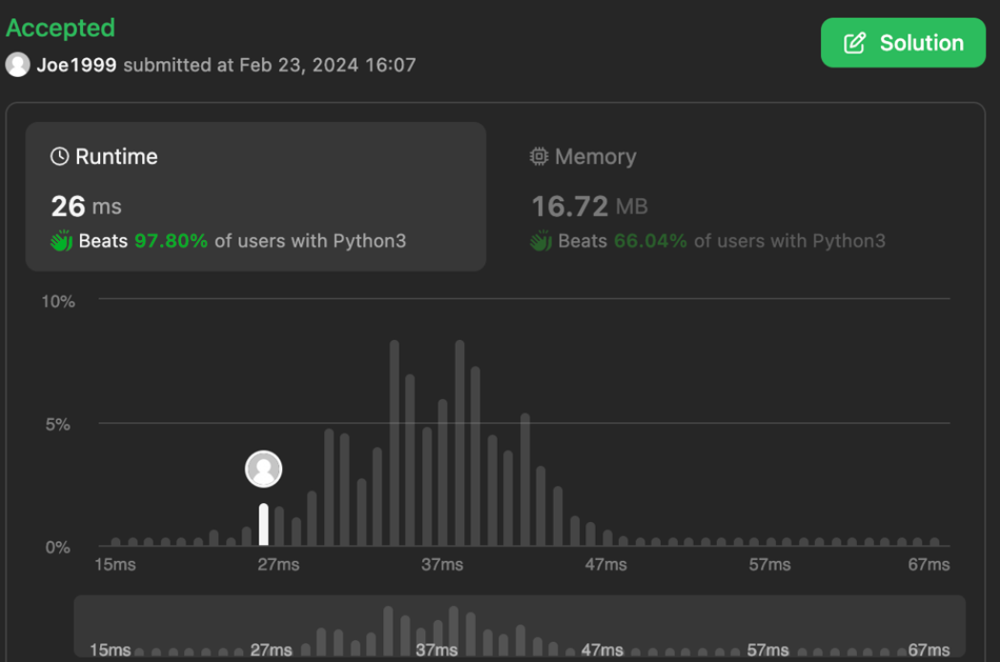

# Intuition
<!-- Describe your first thoughts on how to solve this problem. -->
This is one of my favorite question on leetcode because it is one of few questions that represents real challenge in the world of software engineering.

The standard solution is straight forward. We can keep track of `time`, a table of `posts`, and a table of follows. During `postTweet`, we update `posts` table. During `follow` and `unfollow`, we update `follows` table. And for `getNewsFeed`, we can construct the NewsFeed by looking up `follow` table and `posts` table with the help of *heap* to reduce time complexity. Thanks to the usage of *heap*, this solution already beats **97.80%** of submissions.


In the real world, user will scroll on tweets way more often than they follow or unfollow someone. So, we can cache the NewsFeed for each user during `follow`, `unfollow`, and `postTweet`. I will cover this solution after the standard one. This may not neccessary beats the standard solution on Leetcode, but such caching techniques are often used in real world for better performance with small memory tradeoffs.

# Approach (standard solution)
<!-- Describe your approach to solving the problem. -->
We keep track of `time`, `posts`, and `follows`.
1. `time` is a ticker that decreases negatively because we will use it to sort the NewsFeed on *heap*. By setting it to a negative number, the newer post always comes first.
2. `posts` is a table that maps a userId to all posts from the user sorted posts id with time. For example: `posts[userId] = [(-2, postId3), (-1, postId2), (0, postId1)]`. Here, the first postion in tuples stores the negative `time` that let us sorts `posts` from multiple userIds when constructing NewsFeed.
3. `follows` is a table that maps a userId to a *set* of all users this userId follows. For example `follows[userId] = set(followeeId1, followeeId2, followeeId3)`.

## postTweet, follow, and unfollow

On each `postTweet`, we update `time` ticker and `posts` table by appending new `tweetId` with `time` to the left of userId's posting list. Hence, the posting list will stay sorted by `time`. On each `follow` and `unfollow`, we update the *set* of followee to a `userId (followerId)`.

## getNewsFeed

On getNewsFeed, we first lookup the `follows` table to find all users associate to this `userId`. We will also include the `userId` itself, so the user can see his/her own posts. Wtih this `users` list, we can lookup the posting list, let's call it `tweets` here, by user from `posts` table. We then construct a tuple with `(latest_post_time, tweets)` and push it to the heap, `feeds`. The negative `latest_post_time` in the heap will help us find the next latest tweet on `heappop` operation.

We then pop the heap for 10 times to get the NewsFeed, `news`. On each pop, we want to get the left most (latest tweet) from a user. And if the user has more tweets, we push those tweets back to the heap with the next latest post `time`.

# Complexity (standard solution)
- Time complexity:
<!-- Add your time complexity here, e.g. $$O(n)$$ -->
1. `__init__` = O(1)
2. `postTweet` = O(1)
We append tweetId to a hash table. Both hash table lookup and list appending is constant time operation.
3. `follow` and `unfollow` = O(1)
We add or discard element from `set()` that we store on the `follows` hash table. Both hash table and set operations cost constant time.
4. `getNewsFeed` O(u log u) = O(1) + O(u) + O(u log u) + O(20 log u), 
(u is the number of users that `userId` follows including himself/herself.)

We first go to `follows` table to lookup all users associate with `userId`. The hash table lookup is constant time operation O(1). Then for each users, we lookup the tweets of that user from hash table `posts` which is a linear time operation O(u) to the number of users. We then heappush all users' tweets list to the heap `feeds` that is O(u log u). Then we heappop and heappush the heap `feeds` for 10 times which leads to O(20 log u) = O(log u).

- Space complexity:
<!-- Add your space complexity here, e.g. $$O(n)$$ -->
1. `time` = O(1)
2. `follows` = O(u^2), u is the number of users.
In the worst case scenario, all users follow all users which leads to O(u^2)
3. `posts` = O(u) + O(p), p is the total tweets on Twitter.

In total, we have O(u^2 + p)

# Code (standard solution)
```python
class Twitter:

    def __init__(self):
        self.time = 0 # time decrement negatively
        self.posts = {} # id to a list of posts [(time, tweetId)]
        self.follows = {} # id to a set of follows

    def postTweet(self, userId: int, tweetId: int) -> None:
        p = self.posts
        p[userId] = [(self.time, tweetId)] + p.get(userId, [])
        self.time -= 1

    def getNewsFeed(self, userId: int) -> List[int]:
        users = list(self.follows.get(userId, set())) + [userId]
        feeds = []
        for u in users:
            tweets = copy.deepcopy(self.posts.get(u, []))
            if tweets:
                heapq.heappush(feeds, (tweets[0][0], tweets))
        news = []
        while feeds and len(news) < 10:
            _, tweets = heapq.heappop(feeds)
            news.append(tweets[0][1])
            tweets.pop(0)
            if tweets:
                heapq.heappush(feeds, (tweets[0][0], tweets))
        return news

    def follow(self, followerId: int, followeeId: int) -> None:
        f = self.follows
        s = f.get(followerId, set())
        s.add(followeeId)
        f[followerId] = s

    def unfollow(self, followerId: int, followeeId: int) -> None:
        self.follows.get(followerId, set()).discard(followeeId)
```

# Approach (cache optimization)
Base on the standard approach of `time`, `follows`, and `posts`. We also introduce a new `cache` table and `followee2follower`.
4. `cache` is a table that maps userId to a list of NewsFeed. We update cache during `postTweet`, `follow`, and `unfollow`, so we can instant return NewsFeed from `cache` during `getNewsFeed`.
5. `followee2follower` is a table opposite to `follows`. The `follows` table points `followerId` to `followeeId`, and the `followee2follower` points `followeeId` to `followerId`. We need this table to know how many users' cache to update during `postTweet`.

## postTweet
Other than storing tweetId to the `tweets` posting list on `posts` table, we also want to update the `cache` table. We first lookup from `followee2follower` table to find all users that follows userId because userId's post will affect their NewsFeed. With all `users` being affected, we push the `tweetId` to the left most postion (latest tweet) to their NewsFeed on `cache` table. And if a user's cache list is longer than 10, we pop the right most position (oldest tweet) from that user's cache.

## getNewNewsFeed
This is a new function I add. It's the same function of `getNewsFeed` from **standard solution**.  It constructs NewsFeed without any information from `cache`.

## follow and unfollow
We `add` or `discard` `followeeId` to or from `followerId` on the `follows` hash table as before. But we also want to do the same to `followee2follower` table, so we know which `cache` list to update in `postTweet`. After that, we call `getNewNewsFeed` to reconstruct cache for followerId (userId) because follow or unfollow someone will greatly impact a user's NewsFeed.

## getNewsFeed
We did the optimization to cache the NewsFeed, so we can simly return what's in the cache here! `return self.cache.get(userId, [])`

# Complexity (cache optimization)
- Time complexity:
<!-- Add your time complexity here, e.g. $$O(n)$$ -->
1. `__init__` = O(1)
2. `postTweet` = O(u), u is the number of users
We update the cache for all users that follows `userId`. In the worst case scenario, the `userId` is *Justin Bieber*, this will update all users' cache on the platform. (Bieber's account crash Instagram in the early days because he has too many followers.)
3. `getNewNewsFeed` = O(u log u)
This is the same function of `getNewsFeed` from the *standard approach*.
4. `follow` and `unfollow` = O(u log u) = O(1) + O(1) + O(u log u)
The performance of `follow` and `unfollow` is bottleneck by the `getNewNewsFeed` = O(u log u) function.
5. `getNewsFeed` O(1)
This is where the cache optimization shines. Because we have cache the NewsFeed, this becomes a constant time operation. In the real world, users **read** more often than **write**, and users rarely follow or unfollow other accounts. With cache opimization, we made the following cost change:
* `getNewsFeed` O(u long u) -> O(1)
* `postTweet` O(1) -> O(u)
* `follow` O(1) -> O(u log u)
* `unfollow` O(1) -> O(u log u)
This does not improve performance on this Leetcode question's tests set. But it is worth it in the real world.

- Space complexity:
<!-- Add your space complexity here, e.g. $$O(n)$$ -->
1. `time` = O(1)
2. `follows` = O(u^2), u is the number of users.
In the worst case scenario, all users follow all users which leads to O(u^2)
3. `posts` = O(u) + O(p), p is the total tweets on Twitter.
4. `followee2follower` = O(u^2), this is the same as `follows`
5. `cache` = O(10 u) = O(u)

In total, we have O(u^2 + p). Even though O(u^2) has a power of 2, O(p) is the dominant space cost in the real world. We have finite amount of users on the platform, but we have infinite posts created by users.

# Code (cache optimization)
```python
class Twitter:

    def __init__(self):
        self.time = 0 # time increment negatively
        self.posts = {} # id to a list of posts [(time, tweetId)]
        self.follows = {} # id to a set of follows
        self.cache = {} # list of tweets [tweetId]
        self.followee2follower = {} # opposite to follows

    def postTweet(self, userId: int, tweetId: int) -> None:
        p = self.posts
        p[userId] = [(self.time, tweetId)] + p.get(userId, [])

        # update cache of all users that follows userId
        users = list(self.followee2follower.get(userId, set())) + [userId]
        for u in users:
            self.cache[u] = [tweetId] + self.cache.get(u, [])
            if len(self.cache[u]) > 10:
                self.cache[u].pop()

        self.time -= 1

    def getNewsFeed(self, userId: int) -> List[int]:
        return self.cache.get(userId, [])

    def follow(self, followerId: int, followeeId: int) -> None:
        f = self.follows
        s = f.get(followerId, set())
        s.add(followeeId)
        f[followerId] = s

        # update followee2follower
        f2f = self.followee2follower
        s = f2f.get(followeeId, set())
        s.add(followerId)
        f2f[followeeId] = s

        # update cache
        news = self.getNewNewsFeed(followerId)
        self.cache[followerId] = news

    def unfollow(self, followerId: int, followeeId: int) -> None:
        self.follows.get(followerId, set()).discard(followeeId)

        # update followee2follower
        self.followee2follower.get(followeeId, set()).discard(followerId)

        # update cache
        news = self.getNewNewsFeed(followerId)
        self.cache[followerId] = news

    def getNewNewsFeed(self, userId: int) -> List[int]:
        users = list(self.follows.get(userId, set())) + [userId]
        feeds = []
        for u in users:
            tweets = copy.deepcopy(self.posts.get(u, []))
            if tweets:
                heapq.heappush(feeds, (tweets[0][0], tweets))
        news = []
        while feeds and len(news) < 10:
            _, tweets = heapq.heappop(feeds)
            news.append(tweets[0][1])
            tweets.pop(0)
            if tweets:
                heapq.heappush(feeds, (tweets[0][0], tweets))
        return news
```